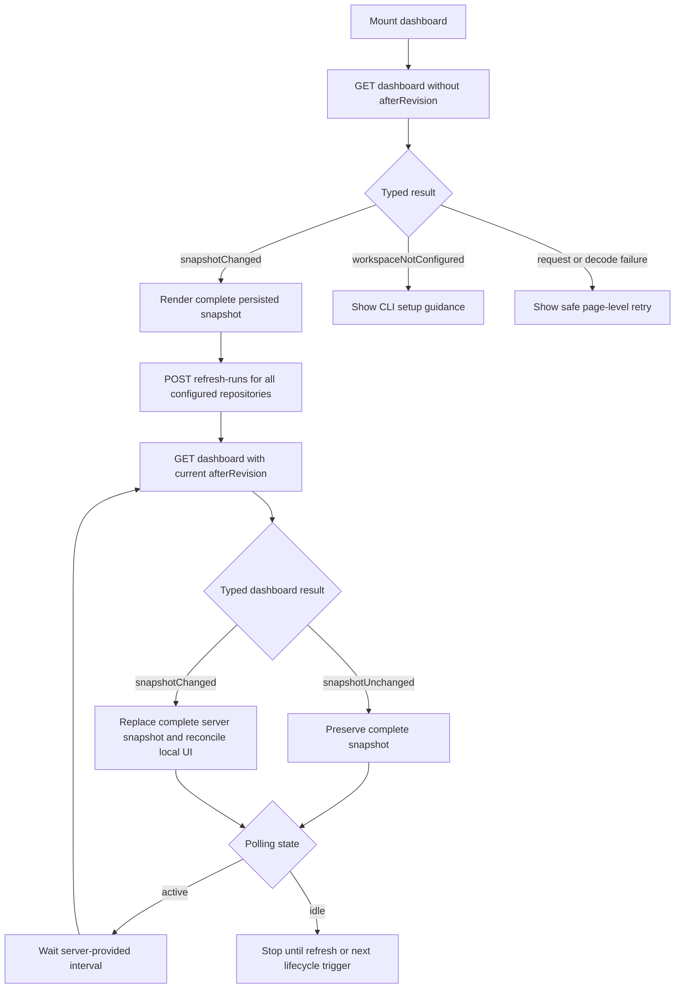
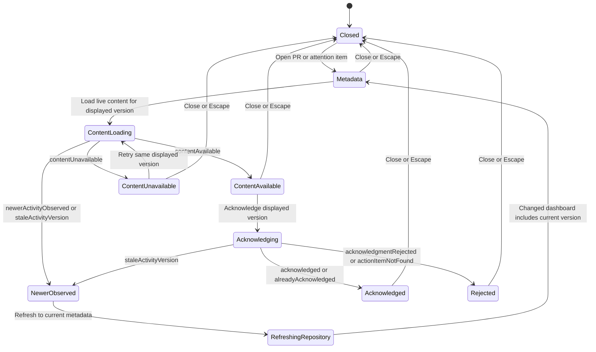

# Dashboard and Detail Drawer Real SPA Design Handoff

**Date:** 2026-08-15

**Status:** Product design approved; written handoff awaiting review

## Executive summary

This specification is the durable handoff from the approved disposable mock to
the real Vue SPA. It defines one product-first dashboard with:

- a compact product header and refresh state;
- a collapsible needs-attention inbox;
- repositories presented as visible parents of their pull requests;
- compact pull-request status and action rows;
- a non-modal detail drawer for readiness, live activity content, and
  exact-version acknowledgment; and
- local handling of partial refresh, unavailable content, newer activity, and
  stale acknowledgment without turning expected business outcomes into page-level
  errors.

The current fixture-backed Vue dashboard under `web/` is the implementation
starting point. The disposable scenario controller and request trace are review
tools only and must not appear in the product.

## Authority and related specifications

The following precedence resolves disagreements:

1. [SPA to Kotlin Backend API Contract Design](2026-08-15-spa-kotlin-api-contract-design.md)
   is authoritative for HTTP operations, schemas, ordering, result
   discriminators, versioning, security, privacy, and status semantics.
2. This document is authoritative for the real SPA's information hierarchy,
   interaction behavior, responsive presentation, and accessibility behavior.
3. [Vue Project Structure Design](2026-08-15-vue-project-structure-design.md)
   defines the current frontend conventions and fixture-source boundary.
4. [Interactive Mock SPA Design](2026-08-15-interactive-mock-spa-design.md)
   and its
   [Feed Hierarchy Revision](2026-08-15-interactive-mock-spa-feed-hierarchy-revision-design.md)
   record the exploration that led to this handoff.

The conversational HTML mock remains disposable and outside tracked project
source. It is evidence for this design, not a runtime dependency or a source of
wire types.

If a desired product field is absent from the canonical API contract, the API
contract must be updated and approved before the real adapter relies on that
field. The SPA must not infer wire fields from the mock.

## Context and starting point

The repository already contains a runnable Vue 3, Vite, and TypeScript slice in
`web/`. It currently:

- loads a deterministic in-process fixture through `DashboardSource`;
- renders pull requests under two repository sections;
- models readiness, build, synchronization, and freshness as discriminated view
  states;
- distinguishes expected `workspaceNotConfigured` from unexpected load failure;
  and
- has focused Vitest and Playwright coverage.

It does not yet contain the canonical `openapi/api-v1.yaml`, a generated client,
revision-aware polling, the needs-attention inbox, the detail drawer, live
activity content, or acknowledgment.

The real implementation should evolve this thin slice. It should not replace it
with a router, global state platform, component library, or a second handwritten
API model.

## Goals

- Make the complete current repository and pull-request snapshot useful on the
  first render.
- Put actionable activity first without forcing a separate inbox route.
- Make repository ownership immediately legible in a dense pull-request feed.
- Preserve last-known-good content during background refresh and expected partial
  failures.
- Keep raw activity bodies out of bulk dashboard data and load them only for an
  exact displayed activity version.
- Make successful acknowledgment, already-acknowledged state, and stale-version
  outcomes impossible to confuse.
- Work in light and dark appearance at desktop, conversation-width, and narrow
  mobile viewports.
- Preserve the current feature-oriented Vue boundaries and generated-client seam.

## Non-goals

- Workspace or repository configuration UI.
- Separate dashboard, inbox, pull-request list, or pull-request detail routes.
- Vue Router, Pinia, a CSS framework, or a component library without a later
  demonstrated need.
- Server-sent events, WebSockets, pagination, or client-side delta application.
- Persisting drawer selection, disclosure state, raw activity content, or CSRF
  state in browser storage.
- Rendering upstream HTML or allowing raw activity bodies into logs, errors,
  analytics, bulk fixtures, or persistence.
- Deriving build-provider URLs or failed-check details in the browser.
- Porting the demo journey selector, reset button, response-step button, or
  request trace into production chrome.

## Selected product approach

The selected approach is one screen-shaped dashboard with a context-first,
non-modal detail drawer. It matches the complete dashboard snapshot returned by
the approved API, keeps navigation shallow for a small local product, and allows
live content and acknowledgment to remain narrowly scoped.

Alternatives remain rejected:

- Separate inbox, repository, and pull-request routes would add navigation and
  cross-route synchronization before the product needs them.
- A grid of independent repository panels would weaken the single-feed hierarchy
  and make compact comparison harder.
- Static state-gallery screens would document outcomes but would not validate
  revision, drawer, or acknowledgment transitions.

## Production information architecture

The production page has one `main` landmark and four product regions in this
order:

1. product header;
2. needs-attention disclosure;
3. repository-grouped pull-request feed; and
4. pull-request detail drawer when open.

The demo controller used during exploration is not part of this hierarchy.

### Wide layout

```text
┌──────────────────────────────────────────────────────────────────────────┐
│ Bitbucket Helper · Workspace           Refresh state · revision · Refresh│
├──────────────────────────────────────────────────────────────────────────┤
│ Needs attention / Actionable activity                    2 open      ▼   │
│ ┌─────────────────────────────┐  ┌─────────────────────────────────────┐ │
│ │ Payments API · PR #184      │  │ Web Store · PR #92                 │ │
│ │ Comment · actor · time      │  │ Changes requested · actor · time   │ │
│ └─────────────────────────────┘  └─────────────────────────────────────┘ │
├────────────────────────────────────────────────┬─────────────────────────┤
│ Configured repositories / Pull request feed    │ Web Store · PR #92      │
│                                                │ Harden CSRF validation  │
│ Payments API · sync · freshness · revision     │ Close                   │
│ ├─ PR #184 · title · build · readiness · actions│────────────────────────│
│ └─ PR #179 · title · build · readiness · actions│ Readiness               │
│                                                │ Activity + exact version│
│ Web Store · sync · freshness · revision        │ Live-content outcome    │
│ └─ PR #92 · failed build · checks · actions    │ Acknowledgment action   │
└────────────────────────────────────────────────┴─────────────────────────┘
```

### Narrow layout

Below `760px`, the page becomes one column. The product header wraps, repository
metadata aligns to the start, pull-request status and controls wrap without
horizontal scrolling, and the open drawer appears after the feed at full width.
Opening a drawer scrolls its heading into view; closing it restores focus to the
control that opened it.

```text
┌──────────────────────────┐
│ Product header           │
├──────────────────────────┤
│ Needs attention       ▼  │
│ attention rows           │
├──────────────────────────┤
│ Repository parent        │
│ ├─ pull request           │
│ └─ pull request           │
│ Repository parent        │
│ └─ failed pull request    │
├──────────────────────────┤
│ Detail drawer            │
│ readiness                │
│ activity                 │
│ live content / Ack       │
└──────────────────────────┘
```

The design was verified at approximately `1024px`, `736px`, and `360px` in both
light and dark appearance. Those widths are regression targets, not device
categories.

## Region design

### Product header

The header shows:

- `Bitbucket Helper`;
- configured workspace display name;
- overall synchronization state;
- current dashboard revision as secondary diagnostic context; and
- a `Refresh` button.

The header contains no route navigation, search, filters, configuration, or
invented aggregate metrics. The initial persisted snapshot remains visible while
refresh work is queued or running. Refresh starts or joins work; it does not
replace the dashboard with a blocking loading screen.

### Needs-attention disclosure

The complete disclosure header is one native button. It always exposes:

- `Needs attention`;
- `Actionable activity`;
- the current `N open` count; and
- a chevron that reflects expanded state.

The button uses `aria-expanded` and `aria-controls`. The inbox starts expanded on
each new page load. Collapsing it hides only the rows and must not alter the
dashboard snapshot, drawer, selection, request state, or counts.

The user's choice persists for the lifetime of the mounted page across refresh
and polling renders. It is not written to `localStorage`, cookies, or another
persistent store. A full page reload starts expanded again.

Each attention row shows repository and pull-request context, activity kind,
actor, activity time, and actionable state. Selecting a row opens that exact
action item in the drawer.

When no items remain, the header shows `0 open`. If expanded, the body shows
`You're all caught up.` Successful acknowledgment updates the count even while
the disclosure is collapsed.

### Repository and pull-request hierarchy

Repositories are rendered in the API's stable order. Each repository header is a
semantic parent containing:

- slug and display name;
- repository revision;
- current activity: idle, queued, or running;
- freshness and last-success age;
- last-attempt problem when present; and
- a Bitbucket repository link.

Its pull requests form one native list indented beneath the header. A neutral
vertical rail connects the child list to the parent, each child has a short elbow,
and the rail terminates at the final child. The decoration adds no ARIA tree role
or custom arrow-key behavior. Screen-reader order remains repository heading,
then its pull-request list.

Partial or failed synchronization never erases last-known-good pull-request rows.
The affected repository shows explicit stale/problem context locally while other
repositories remain current and usable.

### Pull-request row

Each pull-request row contains three logical columns on wide layouts:

1. identity: number, title, author, and updated time;
2. health: build, readiness, actionable count, and acknowledged count; and
3. actions: `Review context` and `Open in Bitbucket`.

At standard widths with a drawer open, actions may wrap to a second row. At
narrow widths, all three groups stack and controls use available width.

`Review context` opens the non-modal product drawer. The pull-request title does
not replace that action by navigating directly to Bitbucket. `Open in Bitbucket`
is the explicit external destination and opens a new tab with `noopener` and
`noreferrer` protection.

If a pull request has actionable activity, `Review context` selects its newest
action item. Otherwise the drawer opens pull-request context and explains that no
actionable activity is attached.

### Build states

Build status is always written as text and paired with semantic color or shape:

- `Build successful`;
- `Build in progress`;
- `Build failed`; or
- `Build unavailable: <safe reason>`.

The representative failed example is Web Store pull request `#92`. It displays:

- `Build failed`;
- `2 failed checks` when that count is supplied; and
- `View build` only as an unavailable control until the API supplies a safe
  destination.

Readiness remains independent: the representative failed PR still shows `5 of 7
checks`. The same build summary appears in the dashboard and drawer from one
view-model field, not duplicated fixture strings.

The approved API contract currently guarantees an explicit build state but does
not yet guarantee a failed-check count or build web URL. Therefore:

- the real SPA can implement `Build failed` immediately;
- `failedCheckCount` must be treated as absent until an approved optional contract
  field exists; and
- `View build` must remain disabled with an accessible unavailable description
  until an approved URL/capability exists.

The client must never derive a build URL from repository or commit strings. An
enabled `View build` is a later compatible-contract enhancement, not a prerequisite
for the first dashboard-and-drawer slice.

### Detail drawer

The drawer is a non-modal complementary region, not a dialog and not a route. The
dashboard remains visible and operable. On wide layouts it occupies
`clamp(300px, 34vw, 350px)` beside the feed. On narrow layouts it becomes a
full-width region after the feed.

The drawer contains:

- repository and pull-request identity;
- a close button;
- fixed readiness summary and representative individual checks;
- actionable and acknowledged counts;
- selected action metadata and exact activity version;
- one localized live-content outcome region; and
- the applicable load, refresh, retry, or acknowledgment action.

Opening from an inbox item selects that exact action. Opening from a pull-request
row selects its newest actionable item if one exists. Switching to another row
replaces the drawer context without stacking panels.

The drawer renders the dashboard's available PR summary immediately, then loads
the richer pull-request projection. Detail loading must not blank already-known
identity or status. Its result may add individual readiness checks and complete
action metadata, but never a raw activity body.

The drawer keeps pull-request metadata visible while live content loads or fails.
Closing it aborts or ignores pending detail and live-content presentation work. An
acknowledgment command that has already been dispatched is not assumed canceled:
its typed result may still reconcile the dashboard, but it must not reopen the
drawer. Closing never cancels service-owned repository refresh. Escape closes the
drawer, and focus returns to the invoking control. The close button is the
initial focus target when the drawer opens.

## Visual language

The approved direction is compact, neutral, and product-like rather than a
marketing page or API inspector.

### Core tokens

| Token   | Light              | Dark               | Use                         |
| ------- | ------------------ | ------------------ | --------------------------- |
| Canvas  | `rgb(244 247 252)` | `rgb(16 21 30)`    | Page/feed background        |
| Surface | `rgb(255 255 255)` | `rgb(29 37 50)`    | Headers, groups, drawer     |
| Raised  | `rgb(249 251 255)` | `rgb(36 45 60)`    | Attention rows and outcomes |
| Text    | `rgb(27 36 52)`    | `rgb(235 239 247)` | Primary text                |
| Muted   | `rgb(91 105 127)`  | `rgb(174 185 204)` | Metadata                    |
| Line    | `rgb(216 224 236)` | `rgb(61 73 93)`    | Borders and tree rails      |
| Accent  | `rgb(44 82 190)`   | `rgb(128 154 255)` | Primary actions and focus   |
| Success | `rgb(34 117 76)`   | `rgb(112 215 163)` | Fresh/success state         |
| Warning | `rgb(121 78 16)`   | `rgb(242 195 109)` | Stale/partial state         |
| Danger  | `rgb(158 48 54)`   | `rgb(255 143 148)` | Failed build                |

Use system sans-serif type at a compact `14px` base and approximately `1.45`
line-height. Controls have a minimum `36px` height, visible focus rings, modest
`7–10px` radii, and borders rather than heavy shadows. Status meaning never relies
on color alone.

These values preserve the approved character. They may be expressed through the
existing `main.css` custom-property system, but should not be copied into
component-scoped one-off values.

## State ownership

State is divided into three categories so server facts, orchestration, and local
presentation cannot drift together.

### Server-derived view state

- dashboard and repository revisions;
- workspace metadata;
- polling instruction;
- repository synchronization, freshness, and problem states;
- pull-request summaries and counts;
- inbox item metadata and exact versions; and
- pull-request detail metadata.

Server-derived state is replaced only by a typed API result or an explicit local
reconciliation allowed by that result, such as successful acknowledgment.

### Request/orchestration state

- initial dashboard loading or failure;
- refresh registration and revision-aware polling;
- drawer detail loading;
- exact-version live-content loading;
- acknowledgment pending/result; and
- newer-activity refresh in progress.

Expected business outcomes remain typed states. Only transport, decoding,
unknown-discriminator, and unexpected failures enter a generic technical failure
path.

### Local presentation state

- needs-attention expanded state;
- selected pull request and action item;
- drawer open/closed state;
- exact version currently displayed in the drawer;
- ephemeral raw live content; and
- the control that should regain focus when the drawer closes.

This state stays in memory. Raw content is discarded when the relevant drawer
context closes or changes.

### Concurrency and stale responses

Only one dashboard polling loop is active. User refresh joins that orchestration
rather than starting a competing loop. Revisions are opaque equality tokens; the
SPA never parses, sorts, increments, or otherwise infers ordering from them.

Drawer detail and live-content requests are keyed by selected pull request,
action item, and activity version. A response for an old selection cannot populate
the current drawer. Live-content requests may be aborted when the context changes,
but correctness must also hold when cancellation loses a race and the old response
arrives.

Acknowledgment disables repeat submission while pending and captures the action
item/version pair at dispatch. Its completed business result may update the global
dashboard even if the drawer has since closed, but it cannot mutate a different
drawer selection or display raw content there.

## Dashboard and polling flow



On `snapshotUnchanged`, the SPA preserves the current rendered snapshot,
selection, drawer, scroll position, and disclosure state. On `snapshotChanged`,
it replaces the complete server-derived snapshot while preserving compatible
local presentation state.

If the selected pull request still exists, the drawer stays open and refreshes
its metadata. If the selected pull request disappears, the drawer closes and a
polite status message explains that the context is no longer available. A drawer
showing a just-acknowledged result may retain its captured context until the user
closes it even though the item has left the inbox.

The client uses the server-provided polling interval and does not reproduce
freshness thresholds or refresh backoff policy.

## Live-content and acknowledgment flow



Raw Markdown appears only after `contentAvailable` for the exact requested
version. It is rendered as safe text/Markdown through a reviewed renderer; the
SPA never accepts upstream-rendered HTML.

The acknowledgment button appears only when the drawer displays loaded content
for an exact version. Its label includes that version, for example
`Acknowledge av_42`. The request sends the same opaque version.

Outcome behavior is exact:

- `acknowledged`: mark the result successful, remove the item from the actionable
  inbox, and update the known PR counts. Advance the opaque dashboard revision
  only when an API result supplies it; otherwise keep the current revision and
  reconcile through the next dashboard query.
- `alreadyAcknowledged`: present a completed state and reconcile the dashboard;
  do not report an error.
- `staleActivityVersion`: do not remove the item, change counts, or show success;
  show the newer version and offer repository refresh.
- `acknowledgmentRejected`: retain context and show the safe rejection reason.
- `actionItemNotFound`: retain enough captured context to explain that the item is
  no longer available and offer dashboard refresh.

## API outcome-to-UI mapping

All outcomes below are processed request results under HTTP `200`. The UI must
branch on `result.type`, not on HTTP status.

| Operation       | Result                     | UI behavior                                                             |
| --------------- | -------------------------- | ----------------------------------------------------------------------- |
| Dashboard       | `snapshotChanged`          | Replace the complete server snapshot and reconcile local state          |
| Dashboard       | `snapshotUnchanged`        | Keep current snapshot unchanged and follow polling instruction          |
| Dashboard       | `workspaceNotConfigured`   | Show CLI setup guidance as a normal empty state                         |
| Refresh         | `refreshRunRegistered`     | Keep snapshot visible; show queued/running state and begin/join polling |
| Refresh         | `noRepositoriesConfigured` | Show a normal no-repositories state with CLI guidance                   |
| Refresh         | `workspaceNotConfigured`   | Show the configuration state, not a network error                       |
| Repository sync | partial/failed state       | Keep last-known-good PRs; show local stale/problem treatment            |
| Live content    | `contentAvailable`         | Render exact-version safe Markdown and reveal acknowledgment            |
| Live content    | `contentUnavailable`       | Keep metadata; show retryability and retry action                       |
| Live content    | `newerActivityObserved`    | Withhold mismatched body; show newer version and refresh path           |
| Live content    | `staleActivityVersion`     | Treat like newer activity; never relabel the body                       |
| Live content    | `actionItemNotFound`       | Keep safe context; explain unavailability and offer refresh             |
| Acknowledgment  | `acknowledged`             | Apply successful local reconciliation                                   |
| Acknowledgment  | `alreadyAcknowledged`      | Show completed/idempotent state and reconcile                           |
| Acknowledgment  | `staleActivityVersion`     | Apply no success mutation; show newer activity path                     |
| Acknowledgment  | `acknowledgmentRejected`   | Keep context and show safe reason                                       |
| Acknowledgment  | `actionItemNotFound`       | Keep captured context and offer dashboard refresh                       |

`4xx` is reserved for invalid requests or browser-security rejection. `500` and
unexpected transport/decoding failures use a safe technical error. Repository-
and drawer-local expected failures must never become a full-page error.

## Representative fixture catalog

Implementation tests should retain deterministic API-aligned fixtures for these
relationships:

```text
Payments API (repo_payments)
├── PR #184 Add retry budget
│   ├── Build successful
│   ├── Readiness 6 of 7
│   └── action_501 / av_42 / actionable comment
└── PR #179 Remove legacy token
    ├── Build successful
    ├── Readiness 7 of 7
    └── 0 actionable / 1 acknowledged

Web Store (repo_store)
└── PR #92 Harden CSRF validation
    ├── Build failed
    ├── 2 failed checks when contract-supported
    ├── Readiness 5 of 7
    └── action_502 / av_18 / changes requested
```

The fixture catalog must keep dashboard metadata separate from raw body fixtures.
Raw content is keyed by action item plus activity version and is available only
to live-content tests.

Six required journeys cover the product risk:

1. healthy refresh with unchanged, independently changed, then idle snapshots;
2. partial refresh preserving last-known-good Web Store data;
3. content load and exact-version acknowledgment success;
4. content unavailable with retained metadata and retry;
5. newer activity discovered, withheld, refreshed, then reloaded; and
6. stale acknowledgment with no successful-state mutation.

## Vue responsibility map

The current feature-oriented structure remains. Names below describe ownership;
the later implementation plan may refine filenames without changing boundaries.

```text
App.vue
└── DashboardView.vue
    ├── ProductHeader
    ├── NeedsAttention
    │   └── AttentionItem
    ├── RepositoryFeed
    │   └── RepositoryGroup.vue
    │       └── PullRequestCard.vue
    └── PullRequestDrawer
        ├── ReadinessSummary
        └── ActivityOutcome
```

Responsibilities are separated as follows:

- `DashboardView` chooses page-level loading/configuration/failure/ready states
  and composes the ready screen.
- dashboard orchestration owns initial load, refresh registration,
  revision-aware polling, and reconciliation of complete snapshots.
- `NeedsAttention` owns only disclosure presentation and emits action selection.
- `RepositoryGroup` renders one semantic parent and its native PR list.
- `PullRequestCard` renders one summary and emits review-context selection.
- drawer orchestration owns detail loading, exact-version content, acknowledgment,
  newer-activity refresh, cancellation, and ephemeral body disposal.
- `PullRequestDrawer` renders drawer state and emits user intent; it does not call
  generated transport code directly.
- a handwritten API adapter maps generated OpenAPI DTOs and result discriminators
  to browser-facing view models.

Components never inspect HTTP status, import fixture catalogs, start polling, or
mutate server-derived models. Fixtures and the future generated-client adapter
implement the same narrow browser-facing ports.

One feature-local store/composable graph is sufficient. Do not introduce Pinia
solely to share state among this screen's descendants; use explicit props/events
or provided feature context until another screen creates a concrete need.

## Delta from the current Vue slice

| Current baseline                                                          | Required design delta                                                                                                  |
| ------------------------------------------------------------------------- | ---------------------------------------------------------------------------------------------------------------------- |
| `DashboardViewModel` has workspace, generated time, and repository groups | Add dashboard revision, polling state, and complete inbox view model                                                   |
| Repository model has name, link, sync, freshness, and PRs                 | Add slug, repository revision, last-attempt/problem presentation, and API-aligned ordering                             |
| PR model has readiness, build state, and actionable count                 | Add acknowledged count and action-item metadata summaries; support optional approved build details                     |
| `DashboardSource.load()` performs one fixture load                        | Evolve the feature boundary for revision-aware dashboard load, refresh, detail, content, and acknowledgment operations |
| `DashboardView` has page-level loading/ready/configuration/failure        | Preserve those states and make background refresh non-blocking                                                         |
| Repository sections are independent rounded panels                        | Render one feed with visible parent rails and terminating PR branches                                                  |
| PR title is the primary external link                                     | Make `Review context` the internal action and `Open in Bitbucket` the explicit external action                         |
| No attention region                                                       | Add complete actionable inbox with page-lifetime disclosure state                                                      |
| No drawer                                                                 | Add non-modal detail, live-content, and acknowledgment state machine                                                   |
| Plain fixture contains no raw bodies                                      | Preserve this; add a separate exact-version live-content fixture catalog                                               |

No handwritten transport DTO should be added to accomplish this delta. Contract
fields arrive through the canonical OpenAPI document and generated TypeScript
client.

## Accessibility requirements

- Use one logical heading hierarchy: product/page, needs attention, repository
  feed, repositories, pull requests, then drawer sections.
- Use native buttons, links, lists, and disclosure semantics; do not add ARIA tree
  interaction to decorative rails.
- Make all operations reachable in normal keyboard order with visible focus.
- On drawer open, focus the close button and label the complementary region with
  the PR title; on close, return focus to the invoker.
- Escape closes the non-modal drawer without changing dashboard data.
- Announce asynchronous page, refresh, drawer, and acknowledgment outcomes through
  scoped polite live regions; unexpected page failure may use `role="alert"`.
- Remove collapsed inbox content from interaction and accessibility traversal.
- Express success, warning, failure, freshness, and disabled state with text plus
  color/shape.
- Use real disabled semantics where an operation cannot be invoked. When an
  unavailable `View build` remains discoverable, use `aria-disabled="true"`,
  prevent all side effects, and provide an accessible reason.
- Maintain no horizontal overflow at `1024px`, `736px`, and `360px`.
- Respect reduced-motion preferences; no motion is required for comprehension.

## Security, privacy, and content handling

- Use only the generated same-origin client through the approved adapter.
- Obtain CSRF state from `browser-session` and keep it in memory only.
- Do not enable permissive CORS or introduce a configurable browser API base URL.
- Open external Bitbucket URLs only from backend-supplied safe fields.
- Render raw Markdown only in the active drawer's content region with a reviewed,
  HTML-disabled rendering path. Reject embedded HTML, restrict link protocols,
  and apply safe new-tab attributes to external links.
- Discard raw content when the drawer context changes or closes.
- Never include raw bodies, credentials, environment data, response bodies,
  stack traces, or notification arguments in UI errors or diagnostics.
- Do not write dashboard, drawer, content, acknowledgment, or CSRF state to
  persistent browser storage.

## Verification strategy

### Unit and composable tests

- Map every known generated result discriminator to an explicit feature result.
- Fail safely on malformed envelopes and unknown discriminators.
- Prove revision-aware polling uses the current revision and server delay.
- Prove unchanged snapshots preserve local presentation state.
- Prove changed snapshots reconcile selection and counts correctly.
- Prove drawer raw content is discarded on close/context change.
- Prove late detail/content responses cannot populate a newer drawer selection.
- Prove one acknowledgment is dispatched per action/version while pending and a
  late result never reopens a closed drawer.
- Prove stale acknowledgment performs no success mutation.

### Component tests

- Needs attention starts expanded, collapses, retains `N open`, survives ordinary
  rerenders, and updates while collapsed.
- Each PR remains beneath exactly one repository parent.
- Rails terminate at the last child without changing semantic list order.
- Failed, successful, in-progress, and unavailable build states render distinct
  text.
- PR `#92` shows failed build and `5 of 7`; optional failed-check details degrade
  cleanly when absent.
- Dashboard and drawer use the same build/readiness view model.
- Drawer controls appear only in valid states and target the displayed version.
- Focus enters and returns from the drawer correctly.

### Browser tests

- Exercise all six journeys from deterministic fixtures.
- Confirm expected business outcomes remain HTTP `200` typed results.
- Verify external link safety and disabled build-control behavior.
- Verify light and dark appearance at `1024px`, `736px`, and `360px`.
- Verify no horizontal overflow, clipped controls, inaccessible hidden content, or
  unexpected console errors.
- Verify no raw body appears before explicit live-content loading or after drawer
  disposal.
- Run a contract-fixture suite before replacing fixtures with the real Kotlin
  adapter.

## Acceptance criteria

- The first successful dashboard result renders a complete useful snapshot before
  background refresh starts.
- Needs attention is collapsible, keeps its count visible, and updates accurately
  while collapsed.
- Repository headers are unmistakable parents of their PR rows at all target
  widths.
- Every PR exposes identity, readiness, build, actionable/acknowledged counts,
  review context, and its explicit Bitbucket destination.
- Failed build is clear without color, remains independent from readiness, and is
  consistent between dashboard and drawer.
- Partial refresh preserves last-known-good PRs and scopes the problem to the
  affected repository.
- The drawer loads raw content only for the exact displayed version.
- Acknowledgment is available only after exact-version content is loaded.
- Successful and idempotent acknowledgment reconcile counts; stale
  acknowledgment never removes or decrements the action.
- Newer activity is never displayed under the requested older version.
- Expected business outcomes use localized UI states under HTTP `200`; only
  request/transport/unexpected failures use technical error treatment.
- The production UI contains no scenario selector, response stepper, reset
  control, contract trace, fixture imports, or handwritten wire DTOs.
- The page is keyboard-operable, focus-safe, screen-reader coherent, and free of
  horizontal overflow in light and dark appearance at all target widths.
- Raw activity bodies and CSRF state remain ephemeral and never enter persistent
  browser storage, bulk dashboard data, diagnostics, or error messages.

## Implementation gates

Before the real SPA connects to Kotlin:

1. approve this written handoff;
2. create the detailed implementation plan in a separate planning step;
3. author and approve the canonical OpenAPI contract before generating clients;
4. resolve the optional failed-check-count/build-link contract enhancement if it
   is included in the first production slice;
5. stabilize the fixture-backed dashboard, polling, drawer, and acknowledgment
   journeys; and
6. pass the shared contract-fixture suite before switching the adapter to Kotlin.

These gates preserve the approved product behavior without promoting the
disposable mock into production architecture.
